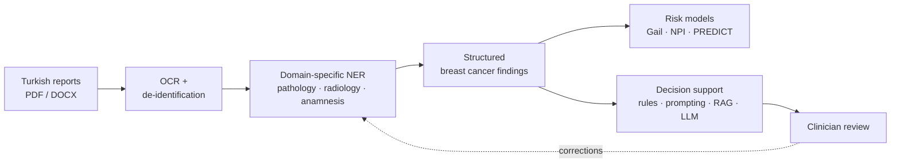

# Hi, I'm Musa Emre Delen

**Computer Engineer** · **AI Researcher @ i-LAB, İstinye University** · **Frontend Developer @ Pievision**

---

## About me

I'm a Computer Engineering graduate working where **AI meets healthcare**. At **i-LAB (İstinye University)** I'm building a **Turkish clinical NLP for breast cancer**: domain-specific language models that read pathology, radiology and anamnesis reports and power a clinical decision support system. English clinical NLP is a mature field with dedicated biomedical models; Turkish has no equivalent for breast cancer reports yet, and that's the gap we're filling.

Alongside research, I work as a **Frontend Developer at Pievision**, building an e-commerce and warehouse management admin panel with Next.js and TypeScript. Shipping production software every day keeps my research grounded: I care about systems that clinicians can actually use, not just models that score well.

## Current focus

- **Turkish breast cancer NLP:** domain-adaptive pretraining and NER fine-tuning on Turkish pathology, radiology and anamnesis reports, compared against general-purpose models.
- **LLMs in clinical decision making:** comparing rule-based, prompt-based, RAG-based and LLM-only decision strategies on the same patient data.
- **Trustworthy medical AI:** de-identification, reproducible model versions and clinician-in-the-loop feedback.
- **Also exploring:** medical image processing, especially ultrasound/DICOM pipelines for liver imaging.

---

## Featured research: CDSSAI, a Turkish clinical NLP for breast cancer

*i-LAB, İstinye University* · *ongoing, paper in preparation*

Breast cancer care runs on free-text reports: pathology, radiology and anamnesis notes, full of abbreviations, Latin terms and negations. English has a mature ecosystem of clinical and biomedical language models for this kind of text; **Turkish has no equivalent for breast cancer reports**. CDSSAI fills that gap with **domain-specific Turkish language models trained on breast cancer reports**, and uses them as the foundation of a clinical decision support system.

**What the NLP extracts**

| Report type | Key findings |
| --- | --- |
| Pathology | tumor size, histological grade, ER / PR / HER2, lymph node status, TNM |
| Radiology | BI-RADS category, lesion size, location and echo pattern |
| Anamnesis | complaints, family history, reproductive history, age |

**How it's built**

- **Domain-specific language models:** a Turkish BERT + CRF NER model with 14 clinical entity types, including *present / absent* assertion labels so negations like "no malignancy" aren't read as findings.
- **Three-stage adaptation:** general clinical DAPT → report-type DAPT → NER fine-tuning, with separate models for pathology, radiology and anamnesis, benchmarked against general-purpose Turkish models.
- **Clinical post-processing:** links biomarkers to their values, attaches lymph-node context and normalizes grade, BI-RADS and TNM into structured fields.
- **Clinician-in-the-loop:** doctors' corrections are stored as new training data for the next iteration (active learning).
- **Privacy by design:** reports are de-identified before processing, and patient identifiers are encrypted and hashed.

**On top of the NLP:** structured findings feed established risk models (Gail, NPI, PREDICT) and a decision layer where rule-based, prompt-based, guideline-grounded RAG and LLM-only strategies make the same decision from the same input, so we can measure which approach actually decides correctly.

Stack: Python · Django · PyTorch · Hugging Face Transformers · EasyOCR · PyMuPDF · pytest + CI

---

## Tech stack

**AI / ML** 

**Frontend** 

**Backend & data** 

**Tools** 

---

## GitHub activity

<picture>
  <source media="(prefers-color-scheme: dark)" srcset="https://github-readme-stats.vercel.app/api?username=Polsyia&show_icons=true&hide_border=true&include_all_commits=true&bg_color=00000000&title_color=2DD4BF&icon_color=2DD4BF&text_color=C9D1D9" />
  
</picture>
<picture>
  <source media="(prefers-color-scheme: dark)" srcset="https://streak-stats.demolab.com?user=Polsyia&hide_border=true&background=00000000&ring=2DD4BF&fire=2DD4BF&currStreakLabel=2DD4BF&currStreakNum=C9D1D9&sideNums=C9D1D9&sideLabels=C9D1D9&dates=8B949E&stroke=30363D" />
  
</picture>

---

*"Dream big. Start small. Act now."*

